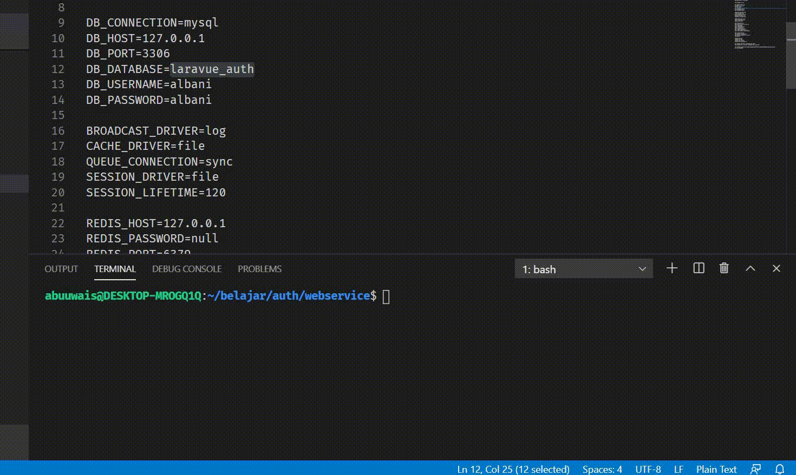

# Laravel JWT Auth Webservice/API

### installation

> git clone git@github.com:utit/Laravel-jwt-auth-webservice.git \<project-name>

> cd \<project-name>

> composer install

> create datatabase

> cp .env.example .env

> setup .env file

> php artisan migrate

> php artisan db:seed

> php artisan serve

#### API URL (Default) 

http://127.0.0.1:8000

## Demo

##### Thank's
[Laravel](http://laravel.com)
[VueJS](http://vuejs.org)
[JWT Auth](https://jwt-auth.readthedocs.io/en/develop/)
